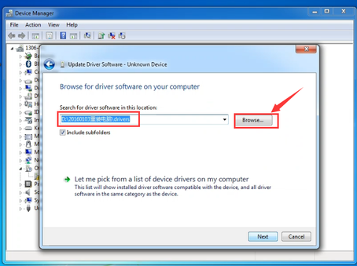
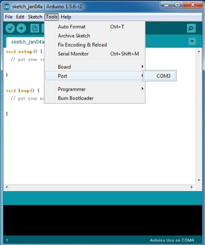

Arduino电子爱好者通用元件包套件503D

# 1、说明

这个套件包含我们玩单片机时基础元件，如不同阻值的电阻、不同颜色的LED灯、不同容值的电容、按键等。它适用于各种单片机和树莓派。我们还会根据这些元件，提供一些基于Arduino开发板的一些学习课程，如LED闪烁试验、按键控灯实验、光控灯实验等，让你对这些电子元件和Arduino开发板有个初步的了解。

# 2、清单

|编码|名称|描述|数量|图片|
|-|-|-|-|-|
|1|LED|F5-红发红-短|2||
|2|LED|F5-黄发黄-短|2||
|3|LED|F5-蓝发蓝-短|2||
|4|LED|F5-绿发绿-短|2||
|5|LED|F5-白发白-短|2||
|6|LED|F5-全彩RGB透明共阴|2||
|7|电阻|碳膜色环 1/4W 1% 10R 编带|10||
|8|电阻|碳膜色环 1/4W 1% 100R 编带|10||
|9|电阻|碳膜色环 1/4W 1% 220R 编带|10||
|10|电阻|碳膜色环 1/4W 1% 330R 编带|10||
|11|电阻|碳膜色环 1/4W 1% 1K 编带|10||
|12|电阻|碳膜色环 1/4W 1% 2K 编带|10||
|13|电阻|碳膜色环 1/4W 1% 5.1K 编带|10||
|14|电阻|碳膜色环 1/4W 1% 10K 编带|10||
|15|电阻|碳膜色环 1/4W 1% 100K 编带|10||
|16|电阻|碳膜色环 1/4W 1% 1M 编带|10||
|17|陶瓷电容|22PF 2.54|5||
|18|独石电容|2.54 0.1UF|5||
|19|电解电容|10UF 50V 5*11MM 插件|2||
|20|电解电容|100UF 50V 8*12MM 插件|2||
|21|轻触按键|6*6*5MM 插件|5||
|22|蜂鸣器|无源 12*8.5MM 5V 普通分体 2K|1||
|23|可调电位器|3386MU 103（三针直排）|1||
|24|光敏电阻|5516 亮电阻5-10KΩ 暗电阻0.2MΩ|2||
|25|热敏电阻|5MM 103 阻值 10K 绿色 插件|1||
|26|二极管|1N4007插件 KED|5||
|27|三极管|2N2222A 0.6A/30V NPN TO-92|5||
|28|三极管|BC547 TO-92|5||
|29|130电机|25*20*15MM 3-6V 13000RPM 白色|1||
|30|面包板|ZY-60 400孔白色（纸卡包装）|1||
|31|面包线|面包板连接线30根|1||
|32|电阻卡|100*70MM|1||

# 3、Arduino IDE和驱动的安装

当我们拿到开发板时，首先我们要安装Arduino IDE和驱动，相关文件我们可以在官网上找到，以下链接是包含各种系统、各种版本的Arduino IDE和驱动任你选择。

<https://www.arduino.cc/en/Main/OldSoftwareReleases#1.5.x>

下面我们介绍下Arduino-1.5.6 版本IDE在Windows系统的安装方法。

下载下来的文件是一个arduino-1.5.6-r2-windows.zip的压缩文件夹，解压出来到硬盘。

双击Arduino-1.5.6 .exe文件

然后

然后

等待安装完成.点击close，安装完成。

1.5.6版本安装后的样子。

接下来是开发板驱动的安装，这次我们安装的是Keyes UNO R3
开发板的驱动，Keyes 2560 R3
开发板安装驱动方法和这个类似，驱动文件可以用同一个文件。

不同的系统，安装驱动的方法也有一些细小的区别，下面我们介绍在WIN 7系统安装驱动的方法。

第一次Keyes UNO R3
开发板连接电脑时，点击计算机--属性--设备管理器，显示如下图。

点击 Unknown device 安装驱动，如下图。

进入下图，选择

找到Arduino安装位置的drivers文件夹

点击“Next”，今天下图选择，开始安装驱动

安装驱动完成，出现下图点击Close。

这样驱动就装好了。点击计算机--属性--设备管理器，我们可看见如下图。

# 4、Arduino IDE的使用方法

Keyes UNO R3
开发板的USB驱动安装成功之后，我们可以在Windows设备管理器中找到相应的串口。

下面示范第一个程序的烧写，串口监视器中显示“Hello World！”。

测试代码为：

int val;

int ledpin=13;

void setup()

{

Serial.begin(9600);

pinMode(ledpin,OUTPUT);

}

void loop()

{

val=Serial.read();

if(val=='R')

{

digitalWrite(ledpin,HIGH);

delay(500);

digitalWrite(ledpin,LOW);

delay(500);

Serial.println("Hello World!");

}

}

我们打开Arduino 的软件，编写一段程序让Keyes UNO R3
开发板接受到我们发的指令就显示“Hello World！”字符串；我们再借用一下Keyes UNO R3 开发板上的 D13
的指示灯，让Keyes UNO R3
开发板接受到指令时指示灯闪烁一下，再显示“Hello World！”。

打开Arduino 的软件，设置板，如下。

设置COM端口，如下

点击编译程序，检查程序是否错误；点击上传程序；Keyes UNO R3 开发板设置OK后右下脚显示如下图，和设备管理器中显示一致。

上传成功，输入R，点击发送，Keyes UNO R3 开发板上的 D13
的指示灯闪烁一次，串口监视器中显示 Hello World! 如下图

那么恭喜你，你的第一个程序已经成功了！！！

# 5、实验课程

## 实验一 LED 闪烁实验

实验说明

LED 闪烁实验是比较基础的实验之一，上一个“ Hello World！”实验里已经利用到了Arduino 自带的LED，这次我们利用其他I/O
口和外接直插LED 灯来完成这个实验。

实验器材

开发板\*1

USB线\*1

LED\*1

220Ω 电阻\*1

面包板\*1

面包板连接线若干

接线图

测试代码

int led = 2; //定义数字口2

void setup()

{

  pinMode(led, OUTPUT);     //设置led为输出

}

void loop()

{

  digitalWrite(led, HIGH);   //开启led

  delay(1000); //延迟1秒

  digitalWrite(led, LOW);    //关闭led

  delay(1000);//延迟1秒

}

测试结果

下载完程序就可以看到我们的IO口外接小灯在闪烁了，这样我们的实验现象为LED不停闪烁，间隔大约为1秒。

## 实验二 呼吸灯实验

实验说明

上一课程中我们只是控制LED的亮和灭，那么我们可以怎么控制LED的亮度呢？本课程中我们把LED接到PWM口中，然后通过改变PWM数值，调节LED亮度，使LED逐渐变亮，和逐渐变暗，从而达到呼吸灯的效果。

实验器材

开发板\*1

USB线\*1

LED\*1

220Ω 电阻\*1

面包板\*1

面包板连接线若干

接线图

测试代码

int ledPin = 3; // 定义数字口3

void setup()

{

pinMode(ledPin, OUTPUT);// 将ledPin设置为输出

}

void loop()

{

for (int a=0; a\<=255;a++)// 设置使LED逐渐变亮

{

analogWrite(ledPin,a); //
开启led,调节亮度，范围是0-255，在255时led最亮

delay(10); // 延迟0.01S

}

for (int a=255; a\>=0;a--) // 设置使LED逐渐变暗

{

analogWrite(ledPin,a); //
开启led,调节亮度，范围是0-255，在255时led最亮

delay(10); // 延迟0.01秒

}

delay(1000);// 延迟1秒

}

测试结果

下载完程序就可以看到我们的IO口外接小灯显示出呼吸灯的效果，小灯先逐渐变亮，后逐渐变暗，循环交替。

## 实验三 广告灯实验

实验说明

在生活中我们经常会看到一些由各种颜色的led灯组成的广告牌，广告牌上各个位置上癿led灯不断的变话,形成各种效果。本节实验就是利用led灯编程模拟广告灯效果。

实验器材

开发板\*1

USB线\*1

LED\*5

220Ω 电阻\*5

面包板\*1

面包板连接线若干

接线图

测试代码

int BASE = 2 ; //第一个 LED 接的 I/O 口

int NUM = 5; //LED 的总数

void setup()

{

for (int i = BASE; i \< BASE + NUM; i ++)

{

pinMode(i, OUTPUT); //设定数字I/O口为输出

}

}

void loop()

{

for (int i = BASE; i \< BASE + NUM; i ++)

{

digitalWrite(i, HIGH); //设定数字I/O口输出为"高"，即逐渐开灯

delay(200); //延迟

}

for (int i = BASE; i \< BASE + NUM; i ++)

{

digitalWrite(i, LOW); //设定数字I/O口输出为"低"，即逐渐关灯

delay(200); //延迟

}

}

测试结果

下载完程序就可以看到我们的IO口外接小灯先逐渐变亮，然后逐渐变暗，循环交替。

## 实验四 交通灯实验 

实验说明

前面我们已经完成了单个小灯的控制实验，接下来我们就来做一个稍微复杂一点的交通灯实验，其实聪明的朋友们可以看出来这个实验就是将上面单个小灯的实验扩展成3
个颜色的小灯，就可以实现我们模拟交通灯的实验了。

实验器材

红色LED\*1

黄色LED\*1

绿色LED\*1

220Ω电阻\*3

面包板\*1

面包板连接线若干

接线图

测试代码

int redled =10; //定义数字10 接口

int yellowled =7; //定义数字7 接口

int greenled =4; //定义数字4 接口

void setup()

{

pinMode(redled, OUTPUT);//定义红色小灯接口为输出接口

pinMode(yellowled, OUTPUT); //定义黄色小灯接口为输出接口

pinMode(greenled, OUTPUT); //定义绿色小灯接口为输出接口

}

void loop()

{

digitalWrite(greenled, HIGH);////点亮 绿灯

delay(5000);//延时5秒

digitalWrite(greenled, LOW); //熄灭 绿灯

for(int i=0;i\<3;i++)//闪烁交替三次，黄灯闪烁效果

{

delay(500);//延时0.5 秒

digitalWrite(yellowled, HIGH);//点亮 黄灯

delay(500);//延时0.5 秒

digitalWrite(yellowled, LOW);//熄灭 黄灯

}

delay(500);//延时0.5 秒

digitalWrite(redled, HIGH);//点亮 红灯

delay(5000);//延时5 秒

digitalWrite(redled, LOW);//熄灭 红灯

}

测试结果

按照接线图接好线，上传完程序，上电后，我们就可以看到我们自己设计控制的交通灯了。实验效果为绿灯亮5秒，绿灯熄灭，黄灯循环闪烁3次，红灯亮5秒，依次循环。

## 实验五 按键控制LED实验

实验说明

I/O 口的意思即为INPUT 接口和OUTPUT
接口，到目前为止我们设计的小灯实验都还只是应用到Arduino 的I/O
口的输出功能，这个实验我们来尝试一下使用Arduino的I/O
口的输入功能即为读取外接设备的输出值，我们用一个按键和一个LED
小灯完成一个输入输出结合使用的实验，让大家能简单了解I/O 的作用。

实验器材

开发板 \*1

USB线\*1

LED\*1

轻触按键\*1

220Ω 电阻\*1

10KΩ 电阻\*1

面包板\*1

面包板连接线若干

接线图

测试代码

int ledPin = 11; //定义数字口11

int inputPin = 3; //定义数字口3

void setup()

{

pinMode(ledPin, OUTPUT); //将ledPin设置为输出

pinMode(inputPin, INPUT); //将inputPin设置为输入

}

void loop()

{

int val = digitalRead(inputPin);

//设置数字变量val，读取到数字口3的数值，并赋值给 val

if (val == LOW) //当val为低电平时，LED变暗

{

digitalWrite(ledPin, LOW); // LED变暗

}

else

{

digitalWrite(ledPin, HIGH); // LED亮起

}

}

测试结果

下载完程序，上电后，当按键按下时小灯亮起，否则小灯不亮。

## 实验六 抢答器实验

实验说明

完成上面的实验以后相信已经有很多朋友可以独立完成这个实验了，我们可以将上面的按键控制小灯的实验扩展成4个按键对应3
个小灯，占用7个数字I/O
接口。为方便接线，我们把3个小灯用一个RGB灯代替。RGB灯可通过 R、 G、
B三个引脚的PWM电压输入可以调节三种基色（红/蓝/绿）的强度从而实现全彩的混色效果。

本实验中我们利用4个按键控制3个PWM口，控制RGB模块发光颜色从而达到抢答器的效果。RGB灯接口说明如下图。

实验器材

开发板\*1

USB线\*1

RGB灯\*1

轻触按键\*4

10KΩ 电阻\*4

220Ω 电阻\*1

面包板\*1

面包板连接线若干

杜邦线若干

接线图

测试代码

int redled=9;

int greenled=10;

int blueled=11;

int redpin=5;

int greenpin=4;

int bluepin=3;

int restpin=2;

int red;

int green;

int blue;

void setup()

{

pinMode(redled,OUTPUT);

pinMode(greenled,OUTPUT);

pinMode( blueled,OUTPUT);

pinMode(redpin,INPUT);

pinMode(greenpin,INPUT);

pinMode(bluepin,INPUT);

}

void loop()

{

red=digitalRead(redpin);

green=digitalRead(greenpin);

blue=digitalRead(bluepin);

if(red==LOW)RED_YES();

if(green==LOW)GREEN_YES();

if(blue==LOW)BLUE_YES();

}

void RED_YES()

{

while(digitalRead(restpin)==1)

{

color(255, 0, 0);

}

clear_led();

}

void GREEN_YES()

{

while(digitalRead(restpin)==1)

{

color(0, 255, 0);

}

clear_led();

}

void BLUE_YES()

{

while(digitalRead(restpin)==1)

{

color(0, 0, 255);

}

clear_led();

}

void clear_led()

{

color(0, 0, 0);

}

void color (unsigned char red, unsigned char green, unsigned char blue) //颜色控制函数

{

analogWrite(redled, red);

analogWrite(greenled,green);

analogWrite(blueled, blue);

}

测试结果

下载完程序，上电后，一个简单的抢答器就做好了，我们根据RGB灯显示的颜色判断是谁抢答成功。在复位后。RGB灯关闭。

## 实验七 电位器调控灯光亮度实验

实验说明

在第二课程中我们直接通过PWM口控制灯的亮度，从而达到呼吸灯的效果。在这课程中我们通过一个电位器，利用电位器调节PWM值，从而控制灯的亮度。

实验器材

开发板\*1

USB线\*1

LED\*1

220Ω 电阻\*1

可调电位器\*1

面包板\*1

面包板连接线若干

接线图

测试代码

int ledpin=11;//定义数字接口11（PWM 输出）

void setup()

{

pinMode(ledpin,OUTPUT);//定义数字接口11 为输出

Serial.begin(9600);//设置波特率为9600

}

void loop()

{

int val=analogRead(0);//读取模拟口A0口的值

val = map(val, 0, 1023, 0, 255);//从0-1023映射到0-255

Serial.println(val);//显示val 变量

analogWrite(ledpin,val);// 打开LED 并设置亮度

delay(100);//延时0.1 秒

}

测试结果

下载完程序后。我们可以通过旋转可调电位器控制小灯的亮度，打开串口监视器，设置波特率为9600，就可看到调节LED亮度的PWM值。

## 

## 实验八 无源蜂鸣器实验

实验说明

蜂鸣器可分为有源蜂鸣器和无源蜂鸣器两种。本课程中主要用到了无源蜂鸣器，无源蜂鸣器内部不带振荡源，直流信号无法令其鸣叫，须用方波驱动。

实验器材

开发板 \*1

USB线\*1

无源蜂鸣器\*1

面包板\*1

正标线若干

接线图

测试代码

code 1:

int buzzer=3; //定义数字口3

void setup()

{

pinMode(buzzer,OUTPUT);//将buzzer设置为输出

}

void loop()

{

unsigned char i,j;//定义变量i，j

while(1)

{

for(i=0;i\<80;i++)// 输出一个频率的声音

{

digitalWrite(buzzer,HIGH);

delay(1);//延迟1ms

digitalWrite(buzzer,LOW);

delay(1);//延迟1ms

}

for(i=0;i\<100;i++)// 输出另一个频率的声音

{

digitalWrite(buzzer,HIGH);

delay(2);//延迟2ms

digitalWrite(buzzer,LOW);

delay(2);//延迟2ms

}

}

}

code 2:

\#define D0 -1

\#define D1 262

\#define D2 293

\#define D3 329

\#define D4 349

\#define D5 392

\#define D6 440

\#define D7 494

\#define M1 523

\#define M2 586

\#define M3 658

\#define M4 697

\#define M5 783

\#define M6 879

\#define M7 987

\#define H1 1045

\#define H2 1171

\#define H3 1316

\#define H4 1393

\#define H5 1563

\#define H6 1755

\#define H7 1971

//列出全部D调的频率

\#define WHOLE 1

\#define HALF 0.5

\#define QUARTER 0.25

\#define EIGHTH 0.25

\#define SIXTEENTH 0.625

//列出所有节拍

int tune\[\]= //根据简谱列出各频率

{

M3,M3,M4,M5,

M5,M4,M3,M2,

M1,M1,M2,M3,

M3,M2,M2,

M3,M3,M4,M5,

M5,M4,M3,M2,

M1,M1,M2,M3,

M2,M1,M1,

M2,M2,M3,M1,

M2,M3,M4,M3,M1,

M2,M3,M4,M3,M2,

M1,M2,D5,D0,

M3,M3,M4,M5,

M5,M4,M3,M4,M2,

M1,M1,M2,M3,

M2,M1,M1

};

float durt\[\]= //根据简谱列出各节拍

{

1,1,1,1,

1,1,1,1,

1,1,1,1,

1+0.5,0.5,1+1,

1,1,1,1,

1,1,1,1,

1,1,1,1,

1+0.5,0.5,1+1,

1,1,1,1,

1,0.5,0.5,1,1,

1,0.5,0.5,1,1,

1,1,1,1,

1,1,1,1,

1,1,1,0.5,0.5,

1,1,1,1,

1+0.5,0.5,1+1,

};

int length;

int tonepin=3; //得用3号接口

void setup()

{

pinMode(tonepin,OUTPUT);

length=sizeof(tune)/sizeof(tune\[0\]); //计算长度

}

void loop()

{

for(int x=0;x\<length;x++)

{

tone(tonepin,tune\[x\]);

delay(500\*durt\[x\]);
//这里用来根据节拍调节延时，500这个指数可以自己调整，在该音乐中，我发现用500比较合适。

noTone(tonepin);

}

delay(2000);

}

测试结果

实验中我们提供了两个例程，上传例程1代码后，蜂鸣器会发出两种不同的声音，实验中，两种声音循环交替。上传例程2中代码后，蜂鸣器会想响起《欢乐颂》的曲子。

## 实验九 感光灯实验

实验说明

完成以上的各种实验后，我们对Arduino
的应用也应该有一些认识和了解了，在基本的数字量输入输出和模拟量输入以及PWM
的产生都掌握以后，我们就可以开始进行一些传感器的应用了。

本次实验我们先进行一个较为简单的光敏电阻的使用实验。光敏电阻既然是可以根据光强改变阻值的元件，自然也需要模拟口读取模拟值了，本实验可以借鉴电位器调控灯光亮度实验，将电位计换做光敏电阻实现当光强不同时LED
小灯的亮度也会有相应的变化。

实验器材

开发板\*1

USB线\*1

LED\*1

220Ω 电阻\*1

10KΩ 电阻\*1

光敏电阻\*1

面包板\*1

面包板连接线若干

接线图

测试代码

int ledpin=11;//定义数字接口11（PWM 输出）

void setup()

{

pinMode(ledpin,OUTPUT);//定义数字接口11 为输出

Serial.begin(9600);//设置波特率为9600

}

void loop()

{

int val=analogRead(0);//读取模拟口A0口的值

Serial.println(val);//显示val 变量

val = map(val, 0, 1023, 0, 255);//从0-1023映射到0-255

analogWrite(ledpin,255-val);// 打开LED 并设置亮度

delay(10);//延时0.01 秒

}

测试结果

下载完程序后，光敏电阻感应到灯光越亮，小灯越暗；光敏电阻感应到灯光越暗，小灯越亮。打开串口监视器，设置波特率为9600，就可看到光敏电阻感应到外界光强所得的模拟值。

## 实验十 热敏电阻传感器实验

实验说明

热敏电阻能够实时感知周边环境温度的变化，随着温度变化，热敏电阻也发生变化。实验中，我们搭配好电路，把温度变化转换成电压变化，将对应的电压输入到Arduino UNO的模拟口上，并在串口监视器上显示出对应的模拟值。

实验器材

开发板\*1

USB线\*1

热敏电阻\*1

10KΩ 电阻\*1

面包板\*1

面包板连接线若干

接线图

测试代码

void setup()

{

Serial.begin(9600); //Set serial baud rate to 9600 bps

}

void loop()

{

int val;

val=analogRead(0);//Read rotation sensor value from analog 0

Serial.println(val,DEC);//Print the value to serial port

delay(100);

}

测试结果

按照上图接好线，上传好代码，上电后，我们就可以看串口监视器上看到代表当前温度的模拟值。当温度升高，电阻减小，模拟值增大；当人体对准温度电阻呼气时，温度升高，显示如下图。

## 实验十一 BC547控制LED实验

实验说明

BC547是一个NPN三极管，实验中我们将BC547当做一个开关，我们通过控制BC547，控制一个LED灯不停的闪烁。

BC547引脚说明如下图

1 为E发射极 2为B基极 3为C集电极

实验器材

开发板\*1

USB线\*1

BC547\*1

LED\*1

220Ω 电阻\*2

面包板\*1

面包板连接线若干

接线图

测试代码

int led = 9;

// the setup routine runs once when you press reset:

void setup() {

// initialize the digital pin as an output.

pinMode(led, OUTPUT);

}

// the loop routine runs over and over again forever:

void loop() {

digitalWrite(led, HIGH); // turn the LED on (HIGH is the voltage level)

delay(1000); // wait for a second

digitalWrite(led, LOW); // turn the LED off by making the voltage LOW

delay(1000); // wait for a second

}

测试结果

按照上图接好线，上传好代码，上电后，我们可以看到LED灯在闪烁了，这样我们的实验现象为LED不停闪烁，间隔大约为1秒。

## 实验十二 2N2222A控制电机转动实验

实验说明

2N2222A是也一个NPN三极管，这个实验和上一实验类似，中我们将2N2222A当做一个开关，我们通过控制2N2222A，控制一个电机转动。

2N2222A引脚说明如下图

1 为E发射极 2为B基极 3为C集电极

实验器材

开发板\*1

USB线\*1

BC547\*1

130电机\*1

220Ω 电阻\*1

面包板\*1

面包板连接线若干

接线图

测试代码

int led = 9;

// the setup routine runs once when you press reset:

void setup() {

// initialize the digital pin as an output.

pinMode(led, OUTPUT);

}

// the loop routine runs over and over again forever:

void loop() {

digitalWrite(led, HIGH); // turn the LED on (HIGH is the voltage level)

delay(1000); // wait for a second

digitalWrite(led, LOW); // turn the LED off by making the voltage LOW

delay(1000); // wait for a second

}

测试结果

按照上图接好线，上传好代码，上电后，我们可以看到电机转1秒钟，停1秒钟，循环交替。

# 6、相关资料链接

<https://pan.baidu.com/s/1OTrRICHa74XO9Ohv5jZSVg>

提取码：pwf6

