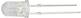
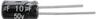
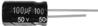
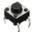
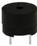
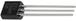
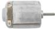
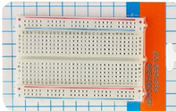
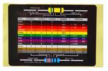

# 2、清单

|编码|名称|描述|数量|图片|
|-|-|-|-|-|
|1|LED|F5-红发红-短|2||
|2|LED|F5-黄发黄-短|2||
|3|LED|F5-蓝发蓝-短|2||
|4|LED|F5-绿发绿-短|2||
|5|LED|F5-白发白-短|2||
|6|LED|F5-全彩RGB透明共阴|2||
|7|电阻|碳膜色环 1/4W 1% 10R 编带|10||
|8|电阻|碳膜色环 1/4W 1% 100R 编带|10||
|9|电阻|碳膜色环 1/4W 1% 220R 编带|10||
|10|电阻|碳膜色环 1/4W 1% 330R 编带|10||
|11|电阻|碳膜色环 1/4W 1% 1K 编带|10||
|12|电阻|碳膜色环 1/4W 1% 2K 编带|10||
|13|电阻|碳膜色环 1/4W 1% 5.1K 编带|10||
|14|电阻|碳膜色环 1/4W 1% 10K 编带|10||
|15|电阻|碳膜色环 1/4W 1% 100K 编带|10||
|16|电阻|碳膜色环 1/4W 1% 1M 编带|10||
|17|陶瓷电容|22PF 2.54|5||
|18|独石电容|2.54 0.1UF|5||
|19|电解电容|10UF 50V 5*11MM 插件|2||
|20|电解电容|100UF 50V 8*12MM 插件|2||
|21|轻触按键|6*6*5MM 插件|5||
|22|蜂鸣器|无源 12*8.5MM 5V 普通分体 2K|1||
|23|可调电位器|3386MU 103（三针直排）|1||
|24|光敏电阻|5516 亮电阻5-10KΩ 暗电阻0.2MΩ|2||
|25|热敏电阻|5MM 103 阻值 10K 绿色 插件|1||
|26|二极管|1N4007插件 KED|5||
|27|三极管|2N2222A 0.6A/30V NPN TO-92|5||
|28|三极管|BC547 TO-92|5||
|29|130电机|25*20*15MM 3-6V 13000RPM 白色|1||
|30|面包板|ZY-60 400孔白色（纸卡包装）|1||
|31|面包线|面包板连接线30根|1||
|32|电阻卡|100*70MM|1||

